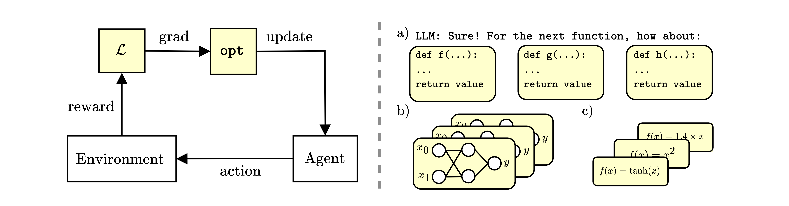

<h1 align="center"> How Should We Meta-Learn Reinforcement Learning Algorithms? </h1>

<p align="center">
    
</p>

This is the official implementation of the paper `How Should We Meta-Learn Reinforcement Learning Algorithms?`, which was accepted to RLC 2025.

In this repository, we provide code for the majority of experiments in our paper. Namely, this repository contains scripts for 4 meta-learned algorithms (OPEN, LPO, OPEN FeedForward and a No Features learned optimiser) trained with 4 meta learning algorithms (Black-Box Learning, Black-Box Distillation, LLM Discovery and Symbolic Distillation). We choose to omit LPG from this codebase; instead, we refer the user to [GROOVE](https://github.com/EmptyJackson/groove). We hope that this codebase provides a useful launchpad for a range of meta-learning experiments!

# 🏗️ Structure
We take a modular approach to our codebase. The file structure is as follows:
```
algorithms/
├── algorithms/
│   ├── learning_algorithms/
│   │   ├── black_box_distillation/
│   │   ├── black_box_learning/
│   │   ├── llm_discovery/
│   │   └── symbolic_distillation/
│   ├── evaluation/
│   ├── utils/
│   │   ├── architectures/
│   │   └── learned_optimization/
│   ├── base.py
│   ├── configs.py
│   └── wrappers.py
├── setup/
│   ├── Dockerfile
│   └── requirements.txt
└── README.md
```

# ⬇️ Installation

Clone this repo using the below:
```bash
git clone git@github.com:AlexGoldie/learn-rl-algorithms.git
```

Please note, this will also download the (brilliant) [Learned Optimization](https://github.com/google/learned_optimization) library!

## 📄 Requirements

We include requirements in `setup/requirements.txt`. Dependencies can be install locally using:
```bash
pip install -r setup/requirements.txt
```

## 🐋 Docker 
We also provide a Dockerfile to make installation easy. To build a docker image, run:
```bash
cd setup
chmod +x build_docker.sh
./build_docker.sh
```

To run a docker container, please use:
```bash
chmod +x run_docker.sh
./run_docker.sh {GPU_NAMES}
```

For example, starting the docker container with access to GPUs `0` and `1` can be done as `./run_docker.sh 0,1`. If there is more than one GPU passed to the docker container, parallelisation will happen automatically.

## 🔑 API Keys

In order to use wandb or llm_discovery, you need to provide their respective API keys to the environment. To do so, please fill these out in `.env`.

# 🖥️ Usage

## 🧠 Meta-Learning

Within each folder in `algorithms/learning_algorithms`, we provide code for the meta-learned algorithms in our paper. Each of these can be called with a similar interface; though distillation requires either a previously trained black-box wandb run or a locally saved model to be able to distil from.

We handle all arguments with `argparse`, and provide instructions for running experiments below.

### ⬛ Black-Box Learning

Black-box learning refers to training the meta-learned algorithm with (in the case of algorithms in this repo) evolution strategies. All algorithms can be found in `algorithms/learning_algorithms/black_box_learning`. Training code will store meta-algorithm weights and meta-evaluation return curves to weights and biases periodically. For instance, to train recurrent OPEN, use the command:

```bash
python3 algorithms/learning_algorithms/black_box_learning/open_recurrent_bb.py [--num-generations <n_gens> --envs <envs> --lr <meta_lr> --popsize <population_size> --num-rollouts <n_meta_seeds> --save-every-k <save_frequency> --noise-level <es_sigma_init> --sigma-decay <sigma_exponential_decay_factor> --lr-decay <meta_lr_exponential_decay_factor> --hsize <meta_net_size>]
```

All other black-box learning algorithms have the same, or very similar, interfaces. Omitting values will use the defaults from our paper. Check the individual files to see if there are any other arguments you might be interested in!

### 💬 LLM Discovery

LLM discovery prompts an LLM with instructions and an initial warm-start algorithm to find a new algorithm. The LLM responds to feedback to guide its discovery process (following [DiscoPOP](https://github.com/SakanaAI/DiscoPOP)). Training code will log discovered algorithms and their respective performance to a table in weights and biases. To train OPEN with LLM discovery, use the following:

```bash
python3 algorithms/learning_algorithms/llm-discovery/open_recurrent_llm.py [--num-generations <n_gens> --resume <previous_conversation_dir> --envs <envs>]
```

Note that we use GPT o3-mini in this codebase, and thus use the OpenAI `completions` API. For LLM discovery to work, you must ensure you include an OpenAI API key in `.env`.

### ▪️ Black-Box Distillation

Black-box distillation involves training one network to mimic the outputs of another. This uses a very similar interface to the above, with the caveat that you must *already* have a previously trained model. This can come from a wandb run or be saved locally (you don't need both!). For example:

```bash
python3 algorithms/learning_algorithms/black_box_distillation/open_recurrent_distil.py [--epochs <n_epochs> --iters <n_iters> --envs <envs> --lr <distil_lr> --lr-stop <anneal_lr_end> --file-name <saved_model_dir> --exp-name <saved_model_wandb> --exp-num <saved_model_gen> --base-hsize <original_net_size> --hsize <new_net_size>]
```

If using wandb, `--exp-name <saved_model_wandb>` refers to the wandb ID and `--exp-num <saved_model_gen>` refers to the generation at which the model was saved.

### 🔢 Symbolic Distillation

Symbolic distillation uses symbolic evolution to find a symbolic equation which matches the outputs of a neural network. We manually set symbolic evolution hyperparameters in `PySRRegressor` for simplicity. Unlike the other algorithms here, symbolic distillation runs on the *CPU* - check the paper to find out why - so don't be surprised if it runs slower than the other learning algorithms.

```bash
python3 algorithms/learning_algorithms/symbolic_distillation/open_ff_symbolic_distil.py [--epochs <n_epochs> --envs <envs> --file-name <saved_model_dir> --exp-name <saved_model_wandb> --exp-num <saved_model_gen> --base-hsize <original_net_size>]
```

Note that for LPO, there is an additional arg: `--grad-loss`. When passed, this will use a fitness function which aims to match the *gradient* of the symbolic LPO, rather than the function outputs.


## 🕵️ Evaluation

While all training scripts are evaluated periodically over the course of meta-learning, it is also possible to call evaluation on any prior meta-learned algorithm using wandb. This is useful for testing on a more expansive set of environments, for more seeds, or just because you want to 🤷

Evaluation uses an almost identical interface for all scripts, with the caveat that **black-box** algorithms have an `--hsize` argument to define the size of the network.

```bash
python3 algorithms/evaluation/eval_{algo}_{form}.py --exp-name <wandb_run_name> --exp-num <wandb_algorithm_generation> --num-runs <meta_evaluation_seeds> [--hsize <hsize_for_bb>]
```


# 📝 To Do

We have plans to expand this repository in the future. In particular, we plan to:
- Replace argparse with hydra configs for ease of use.
- Integrate evosax v2.0 into our codebase.
- Add new learned algorithms!

For any more suggestions, please reach out to goldie [at] robots [dot] ox [dot] ac [dot] uk!

# 📚 Related Work

The following projects were used extensively in our work. Our codebase also takes heavy inspiration from a number of these respositories:
- 🚪 [OPEN](https://github.com/AlexGoldie/rl-learned-optimization/)
- ➕ [PySR](https://github.com/MilesCranmer/PySR)
- 🪩 [DISCOPOP](https://github.com/SakanaAI/DiscoPOP)
- 🦎 [Evosax](https://github.com/RobertTLange/evosax)
- 🎓 [Learned Optimization](https://github.com/google/learned_optimization)
- ⚡ [PureJaxRL](https://github.com/luchris429/purejaxrl)
- 🐜 [Brax](https://github.com/google/brax)
- 💪 [Gymnax](https://github.com/RobertTLange/gymnax)


# 🔖 Citation

If you like our work and take any inspiration from it, or use our code in your experiments, please cite the following:
```
@inproceedings{
    goldie2025how,
    title={How Should We Meta-Learn Reinforcement Learning Algorithms?},
    author={Alexander David Goldie and Zilin Wang and Jakob Nicolaus Foerster and Shimon Whiteson},
    booktitle={Reinforcement Learning Conference},
    year={2025},
}
```
